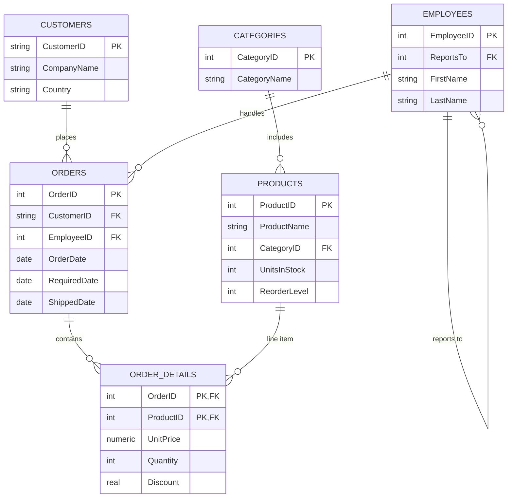

# Northwind Business Analytics — SQL Data Cleaning, EDA & Insights

End-to-end data cleaning, exploratory analysis, and business-insight extraction done **entirely
in SQL** (CTEs, window functions, joins, aggregations) against the classic Northwind relational
database — orders, order line items, products, customers, and employees.

## Why SQL-only (no Python/BI tool)
This project deliberately does the full workflow — quality checks, aggregation, ranking,
trend analysis, cohort-style churn detection — using only SQL, to demonstrate SQL fluency
independent of a scripting language or dashboarding tool.

## Database
`northwind.db` (SQLite) — 16,282 orders, 609,283 order line items, 93 customers, 77 products,
9 employees, 8 categories.

## Schema
The database has 13 tables total; `analysis.sql` queries the 6 below. (Suppliers, Shippers,
Territories, Regions, EmployeeTerritories, and two empty customer-demographics tables exist in
the schema but aren't used in the analysis.)



**Legend:** `||--o{` = one-to-many (one row on the `||` side relates to zero-or-more rows on the
`o{` side) — e.g. one `CUSTOMERS` row relates to many `ORDERS` rows. `PK` = primary key,
`FK` = foreign key, `PK,FK` = column is both (a composite key that's also a reference to another
table, as in `ORDER_DETAILS`).

| Table | Rows |
|---|---|
| `Customers` | 93 |
| `Orders` | 16,282 |
| `Order Details` | 609,283 |
| `Products` | 77 |
| `Categories` | 8 |
| `Employees` | 9 |

`"Order Details"` needs double-quoting in SQL since the table name contains a space.

`analysis.sql` also creates one derived object, `OrderLineRevenue` — a view over `Order Details`
that computes `UnitPrice * Quantity * (1 - Discount)` once as `LineRevenue`, so every revenue
query joins against it instead of repeating that formula. It's created with
`CREATE VIEW IF NOT EXISTS`, so re-running the script is safe.

## Repo Structure
```
sql_eda_project/
├── analysis.sql        # full annotated SQL script (cleaning -> EDA -> insights)
├── northwind.db         # SQLite database
├── run_queries.py       # runs every query in analysis.sql and prints results
└── README.md
```

## How to Run
```bash
# Option 1: any SQLite client
sqlite3 northwind.db
.read analysis.sql

# Option 2: Python
python3 run_queries.py
```

## Section 1 — Data Cleaning / Quality Checks
| Check | Result |
|---|---|
| Orphaned orders (no matching customer) | 0 |
| Orphaned order line items (no matching product) | 0 |
| Invalid quantity/price/discount values | 0 |
| Orders never shipped | **21** |
| Orders shipped before they were placed | 0 |
| Duplicate company names (case-insensitive) | **1 pair** — two distinct customers both named "IT" (`Val2`, `VALON`) |

The duplicate-name check is a good example of why data cleaning needs to look past primary
keys — these are two legitimately different customer records that would confuse any
name-based lookup or manual reporting.

## Section 2 — Exploratory Data Analysis
- **Total revenue:** $448.4M across 16,282 orders and 93 customers (SQLite-computed via
  `SUM(UnitPrice * Quantity * (1 - Discount))`)
- **Revenue by category:** Beverages leads at $92.2M, followed by Confections ($66.3M) and
  Meat/Poultry ($64.9M); Grains/Cereals is lowest at $28.6M
- **Average fulfillment time:** 7.84 days (range: 0-37 days)
- **Late shipments:** 3,755 orders (23.1%) shipped *after* the promised `RequiredDate` —
  a meaningful on-time-delivery problem worth flagging operationally

## Section 3 — Business Insights
- **Top product by revenue:** Côte de Blaye ($53.3M) — more than double the #2 product
  (Thüringer Rostbratwurst, $24.6M), making it a clear single-point-of-failure risk if that
  supplier has issues
- **Top customer:** B's Beverages ($6.15M lifetime revenue), ranked via `RANK() OVER (...)`
- **Employee performance:** revenue is fairly evenly spread across the 9 sales employees
  ($48.3M-$51.5M each) — no single rep is carrying the business, which is healthy, but also
  means there's no clear "top performer" playbook to replicate
- **Month-over-month revenue** swings noticeably (e.g. +72% in Aug 2012, -30% in Aug 2013) —
  computed with `LAG()` — worth pairing with a marketing/seasonality calendar to explain the swings
- **Discount usage is very low across the board** (0.01%-0.03% average discount rate per
  category) and clearly isn't a major revenue lever in this dataset — discounting isn't being
  used aggressively enough to draw conclusions about its effect on volume
- **8 customers** have gone 60+ days without ordering (average customer order gap is only
  ~27 days), flagging them as re-engagement targets — led by FISSA Fabrica Inter. Salchichas S.A.
  at 169 days
- **15 active products are at or below their reorder level**, including Gorgonzola Telino
  (0 units in stock, 70 on order) — a concrete restocking-priority list

## Suggested Resume Bullets
- Performed SQL-only data cleaning and EDA on a 609K-row relational order database, identifying
  data-quality issues including duplicate customer records and 3,755 late shipments (23% of orders).
- Wrote CTE- and window-function-based queries (RANK, LAG) to build customer/employee revenue
  leaderboards and month-over-month growth analysis across $448M in order revenue.
- Built a churn-risk and stockout-risk query set, surfacing 8 at-risk customer accounts and
  15 products below reorder threshold for operational follow-up.
